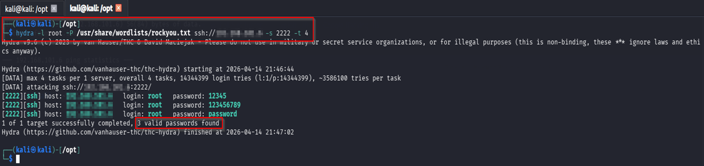
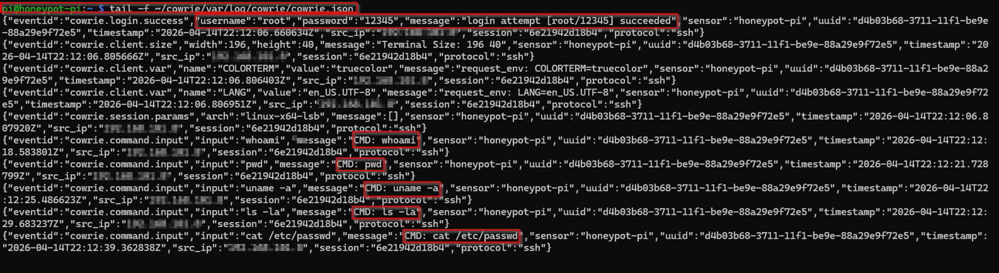
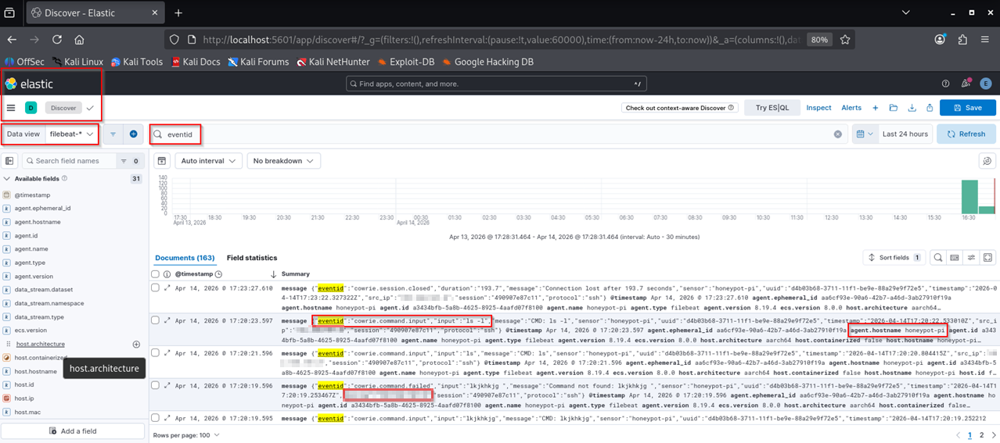
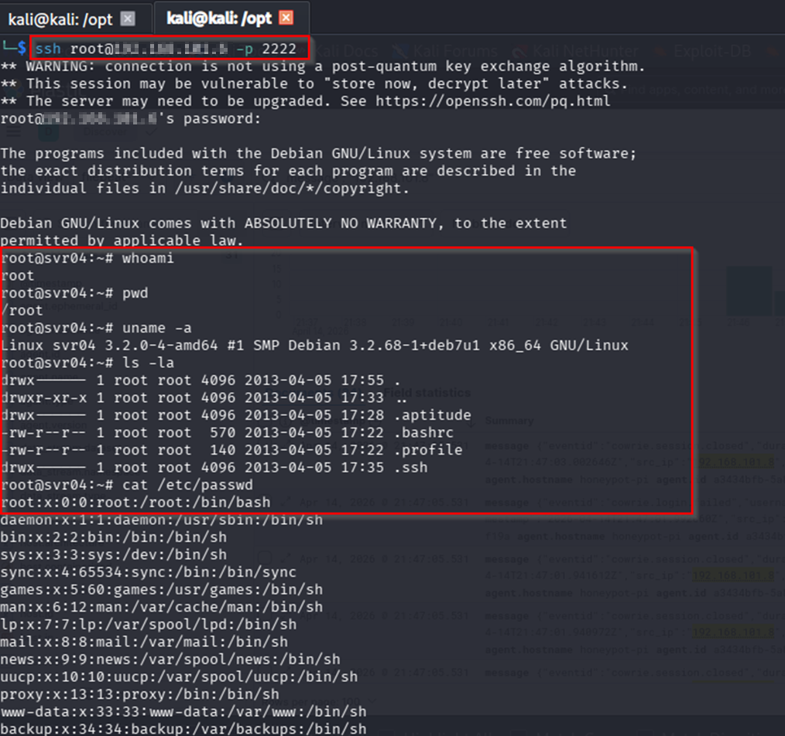
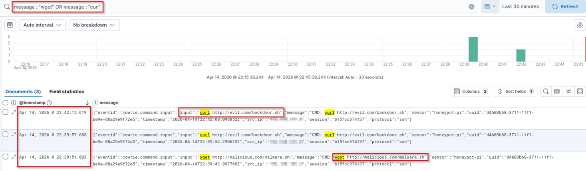

# 🛡️ Cowrie Honeypot + ELK Stack Detection Lab

## 🔍 Overview
This project demonstrates the design, deployment, and monitoring of a real-world SSH honeypot using **Cowrie**, integrated with the **ELK Stack (Elasticsearch, Filebeat, Kibana)** for log ingestion and detection.

The objective is to simulate attacker behavior, capture malicious activity, and build visibility through centralized logging and analysis — mimicking real SOC and detection engineering workflows.

---

## ⚙️ Architecture

Kali Linux (Attacker)  
        ↓  
Cowrie Honeypot (Raspberry Pi)  
        ↓  
Filebeat (Log Shipper)  
        ↓  
Elasticsearch (Storage & Indexing)  
        ↓  
Kibana (Visualization & Analysis)

---

## 🧪 Attack Scenarios

### 1. SSH Brute Force Attack (Hydra)
- Simulated credential brute force using Hydra from Kali Linux
- Multiple login attempts with username/password combinations
- Captured:
  - Failed login attempts
  - Successful authentication events

---

### 2. Interactive Command Execution
- Attacker gained access to the honeypot via SSH
- Executed common reconnaissance commands:
  - `whoami`
  - `pwd`
  - `uname -a`
  - `cat /etc/passwd`
- Captured full attacker session activity

---

### 3. Post-Exploitation Behavior Simulation
- Simulated attacker exploring the environment after login
- Observed command patterns and interaction flow
- Logged attacker intent and behavior for analysis

---

## 🧠 Detection Engineering

This project includes detection logic built using Kibana Query Language (KQL) to identify malicious SSH activity captured by the Cowrie honeypot.

---

### 🔐 Detection 1: SSH Brute Force Attack

**Description:**  
Identifies multiple authentication attempts (failed and successful) indicating brute-force activity.

**KQL Query:**

    ```
    eventid: "cowrie.login.failed"
    ```
**Detection Logic:**
- High volume of login attempts from a single IP
- Multiple failed attempts followed by a success
- Repeated credential guessing patterns

**MITRE ATT&CK Mapping:**
- T1110 – Brute Force

---

### 🧾 Detection 2: Command Execution Activity

**Description:**  
Detects commands executed by attackers after gaining access to the honeypot.

**KQL Query:**

    ```
    eventid: "cowrie.command.input"
    ```
**Detection Logic:**
- Execution of reconnaissance commands:
  - whoami
  - uname -a
  - cat /etc/passwd
- Indicates post-compromise activity

**MITRE ATT&CK Mapping:**
- T1059 – Command and Scripting Interpreter

---

### 🌐 Detection 3: Attacker IP Tracking

**Description:**  
Identifies and correlates attacker activity based on source IP.

**KQL Query:**

    ```
    eventid: "src_ip:*"
    ```
**Detection Logic:**
- Repeated activity from same IP
- Correlation between login attempts and command execution
- Helps in attacker profiling

---

## 🚨 Detection Summary

The following attack behaviors were successfully detected:

- SSH brute-force attempts using Hydra
- Unauthorized login attempts
- Post-authentication command execution
- Attacker source tracking and activity correlation

This demonstrates practical detection engineering using centralized logging and analysis with the ELK Stack.

---

## 🔎 Sample KQL Queries

```
eventid: "cowrie.login.failed"

eventid: "cowrie.login.success"

eventid: "cowrie.command.input"
```

---

## 📈 Results

- Successfully captured and analyzed attacker behavior in real time
- Built visibility into:
  - Authentication attacks
  - Session activity
  - Command execution patterns
- Demonstrated practical detection engineering workflow using ELK Stack

---

## 🛠️ Technologies Used

- Cowrie Honeypot
- Elasticsearch
- Filebeat
- Kibana
- Kali Linux
- Hydra

---

## 🛡️ Key Learnings

- Practical implementation of honeypots for threat detection  
- Log pipeline creation using Filebeat → Elasticsearch  
- Writing detection logic using Kibana Query Language (KQL)  
- Understanding attacker behavior during SSH-based intrusions  
- Hands-on experience in SOC-style monitoring and analysis  

---

## 🚀 Future Improvements

- Integration with alerting (ElastAlert / SIEM rules)
- Dashboard creation for attack visualization
- GeoIP enrichment for attacker source tracking
- Automated detection rules for brute-force patterns

---

## 📸 Attack Demonstration

### 🔐 Hydra Brute Force Attack


---
  
### 🐝 Cowrie Logs - Login Attempts


---
  
### 📊 Kibana - Login Events


---
  
### 🧾 Command Execution Activity


---

### 📊 Kibana - Attacker Commands


---

## 📌 Conclusion

This project showcases hands-on skills in detection engineering, log analysis, and adversary simulation.  
It reflects real-world SOC operations and demonstrates the ability to detect, analyze, and interpret attacker behavior using industry-standard tools.

